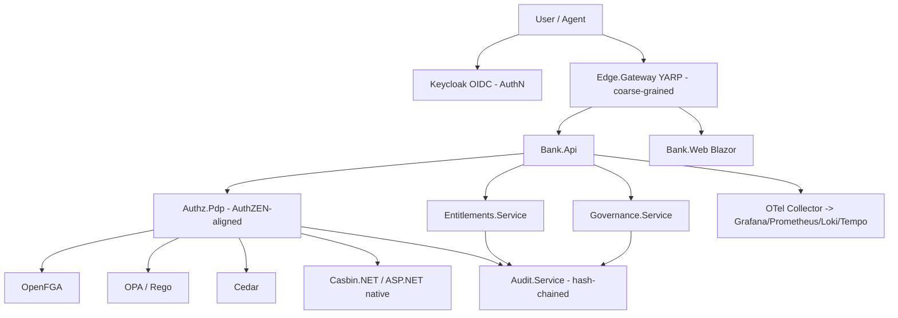

# Architecture

> **Last updated:** 2026-07-02 (bootstrap / CS-queue authoring)

## Overview

AuthZ & Entitlements Lab - a .NET Aspire application that evaluates fine-grained
authorization and entitlements side by side and doubles as a reusable reference
architecture. A fintech / banking back-office product (accounts, approvals,
segregation-of-duties, maker-checker) exercises four complementary layers:

0. **AuthN** - verified identity via OIDC/OAuth2 (Keycloak; Microsoft Entra ID as the real-world option).
1. **Coarse-grained authorization** - token scopes/claims enforced at a YARP edge gateway (cheap, stateless first gate).
2. **Fine-grained authorization (FGA)** - a unified, AuthZEN-aligned PDP with pluggable engines (contextual, per-resource).
3. **Entitlements** - commercial (plans/seats/features/quotas) and access-governance (access packages/JIT/reviews).

Coarse- and fine-grained authorization are **both** first-class and complementary: the edge
rejects whole request classes cheaply; the PDP answers the contextual question the edge cannot.

Key characteristics:

- **Runtime / language:** .NET 10 (C#) + Blazor; Aspire AppHost orchestration; polyglot engines run as containers.
- **Deployment target:** local-first (Aspire dashboard); Azure Container Apps via `azd` (later phase).
- **Primary consumers:** the reference fintech app, an interactive authorization playground, and evaluation/benchmark tooling.

## Components

- **Edge.Gateway** - YARP reverse proxy; AuthN token validation + coarse-grained scope/claim/audience/tenant enforcement.
- **Bank.Api** - fintech domain API (accounts, transactions, approvals).
- **Bank.Web** - Blazor UI: fintech workflows + AuthZ Playground + Audit Explorer.
- **Authz.Pdp** - unified fine-grained PDP; `IAuthorizationDecisionProvider` + per-engine adapters + scenario catalog.
- **Entitlements.Service** - commercial entitlements (plans/modules/seats/features/quotas; OpenFeature + Unleash + metering).
- **Governance.Service** - access packages, JIT elevation, access reviews, break-glass, delegation / on-behalf-of.
- **Audit.Service** - append-only, hash-chained audit log + verification/query API.
- **ServiceDefaults** - shared OpenTelemetry / health / resilience wiring.
- **Bank.Workers** - background jobs (review campaigns, quota rollups, tuple sync).

Engines (via adapters behind `Authz.Pdp`): ASP.NET Core native + Casbin.NET (in-process),
OpenFGA (ReBAC), OPA/Rego, Cedar (MonoCloud, in-process); expansion: SpiceDB, Cerbos,
Ory Keto, Oso, Topaz.

## Data model

### Stores

| Store | Type | Owner component | Notes |
|-------|------|-----------------|-------|
| `bank` | Postgres | Bank.Api | tenants, users, roles, branches, accounts, transactions, approvals |
| `openfga` | Postgres | OpenFGA | ReBAC relationship tuples |
| `entitlements` | Postgres | Entitlements.Service | plans, modules, seats, quotas, usage |
| `governance` | Postgres | Governance.Service | access packages, JIT grants, reviews |
| `audit` | Postgres | Audit.Service | append-only hash-chained audit events |

### State lifecycle

Every request flows AuthN -> coarse (edge) -> fine (PDP) -> entitlements, each emitting an
audit event and OTel telemetry. JIT and break-glass grants are time-bound and auto-expire;
access-review campaigns recertify standing access.

## Decision log

### Decision: Adopt agent-harness for process orchestration
- **Date:** 2026-07-02
- **Status:** Accepted
- **Context:** Multi-agent, parallelizable build; need clickstop lifecycle, review gates, CI.
- **Decision:** Adopt `henrik-me/agent-harness` (pinned `v0.12.0`); work tracked as clickstops.
- **Consequences:** PR review-evidence + plan-review gates apply; the repo is the persistent memory.

### Decision: Unified AuthZEN-aligned PDP abstraction
- **Date:** 2026-07-02
- **Status:** Accepted
- **Context:** Need a fair, apples-to-apples comparison across engines.
- **Decision:** One `IAuthorizationDecisionProvider` contract (AuthZEN-aligned) + per-engine adapters + a shared scenario catalog.
- **Consequences:** Engine swap without app changes; enables the playground, benchmarks, and migration/portability.

### Decision: Coarse- and fine-grained authorization are both first-class
- **Date:** 2026-07-02
- **Status:** Accepted
- **Context:** The lab must teach the difference and show the two are complementary.
- **Decision:** Enforce coarse-grained (token scopes/claims) at a YARP edge; fine-grained (contextual) at the PDP.
- **Consequences:** Defense in depth; a clear handoff; both layers emit audit + telemetry.

## Project goals & evaluation framework

**Objective:** both (a) an **evaluation lab** comparing fine-grained authorization engines and
entitlement approaches, and (b) a **reusable reference architecture**. The fintech back-office
demo exercises every layer.

**What we evaluate**
- **FGA engines** behind the unified AuthZEN-aligned PDP: ASP.NET Core native + Casbin.NET,
  OpenFGA (ReBAC), OPA/Rego, Cedar; expansion: SpiceDB, Cerbos, Ory Keto, Oso, Topaz.
- **Entitlements** in both senses: commercial (plans/seats/features/quotas) and access-governance
  (access packages, JIT elevation, access reviews).

**Comparison-matrix dimensions** (produced in CS23): supported models (RBAC/ReBAC/ABAC/PBAC),
consistency, decision latency, reverse-index / "list objects", policy language and expressiveness,
testability, auditability, operational burden, .NET support, AuthZEN alignment, licensing / maturity,
hosting (self vs managed), and managed-vs-self-host TCO (CS25).

**Cross-cutting evaluation dimensions** (each a clickstop): explainability "why allowed / why denied"
(CS16), policy lifecycle + validation/testing (CS17), performance benchmarking (CS24), security
hardening + threat model (CS18), agent / non-human access + on-behalf-of (CS19), migration /
portability (CS20), compliance mapping SOX/PCI-DSS/GDPR (CS22), break-glass + delegation (CS21).

## Phase roadmap

The 27-clickstop arc (authoritative dependency map + parallelization waves in
[CONTEXT.md](CONTEXT.md); per-CS detail in `project/clickstops/planned/`):

0. **Foundations** — Aspire solution + fintech domain (CS01-CS02).
1. **AuthN + coarse-grained edge** — Keycloak + YARP gateway (CS03-CS04).
2. **Fine-grained AuthZ + unified PDP** — AuthZEN abstraction + engine adapters (CS05-CS09).
3. **Entitlements** — commercial + access-governance (CS10-CS11).
4. **Observability + audit** — OTel/Grafana stack + hash-chained audit (CS12-CS13).
5. **Product + playground** — Blazor app + engine playground + audit explorer (CS14-CS15).
6. **Evaluation lab** — comparison matrix, survey, benchmarks, ADRs (CS23-CS25).
7. **Expansion + Azure** — more engines, full OpenMeter, azd deploy (CS26-CS27).

Cross-cutting CS16-CS22 land alongside as their prerequisites complete.
