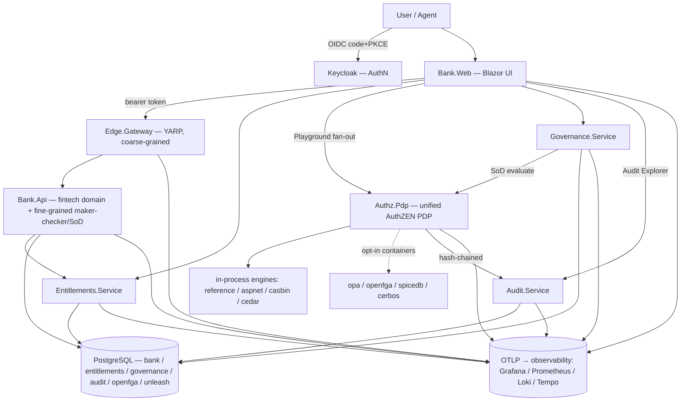
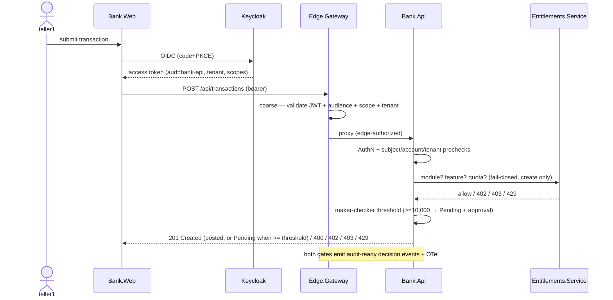

# Architecture

> **Last updated:** 2026-07-04 — reflects the shipped surface. See [CONTEXT.md](CONTEXT.md) for the live clickstop state.

## Overview

The **AuthZ & Entitlements Lab** is a .NET Aspire application that evaluates fine-grained
authorization and entitlements side by side and doubles as a reusable reference architecture. A
fintech / banking back-office product (accounts, transactions, approvals, segregation-of-duties,
maker-checker) exercises four complementary layers, all observable and audited:

0. **AuthN** — verified identity via OIDC/OAuth2 (Keycloak; Microsoft Entra ID as the real-world option).
1. **Coarse-grained authorization** — token scope / claim / audience / tenant checks enforced at a
   YARP edge gateway (a cheap, stateless first gate).
2. **Fine-grained authorization (FGA)** — a unified, AuthZEN-aligned PDP with a pluggable engine
   seam (contextual, per-resource).
3. **Entitlements** — commercial (plans / seats / features / quotas) and access-governance (access
   packages / JIT / reviews / break-glass / delegation).

Coarse- and fine-grained authorization are **both first-class and complementary**: the edge rejects
whole request classes cheaply; the fine-grained layer answers the contextual question the edge
cannot. A tamper-evident, hash-chained **audit log** and **OpenTelemetry** span every layer.

**Key characteristics**

- **Runtime / language:** .NET 10 (C#) minimal APIs + Blazor; Aspire AppHost orchestration;
  polyglot engines run as containers.
- **Deployment target:** local-first (`aspire run` + the Aspire dashboard). Azure Container Apps
  via `azd` is a planned phase (CS27).
- **Primary consumers:** the reference fintech app + Blazor UI, an interactive authorization
  playground, an audit explorer, and evaluation / benchmark tooling.
- **Default determinism:** the default run uses the in-process `reference` PDP engine and the
  in-memory entitlements provider — no third-party engine required. Container-backed engines are
  opt-in.

## Top-level diagram



Notes: the fine-grained decision for the **transaction path** is enforced **inside Bank.Api**
(maker-checker / SoD / tenant) — Bank.Api does not currently call `Authz.Pdp`. The unified PDP is
the shared evaluation surface exercised standalone (Playground, scenario parity, what-if/shadow,
AuthZEN, ReBAC) and by **Governance** for its segregation-of-duties check. Today the **PDP** is the
service wired to forward decisions into `Audit.Service`; the edge, Bank.Api, entitlements, and
governance emit audit-ready structured events via OpenTelemetry, with direct Audit.Service
ingestion planned.

## Components

The solution (`AuthzEntitlements.sln`) has **11 projects** under `src/` — seven long-running
services, two CLI tools, one Aspire orchestrator, and one shared library:

| Project | Kind | Responsibility | Store |
|---|---|---|---|
| **AppHost** | Aspire orchestrator | Wires every resource: Postgres, Keycloak, observability, the app services, and the opt-in engine containers | — |
| **ServiceDefaults** | Shared library | OpenTelemetry, health checks, service discovery, resilience; OTLP export gated on `OTEL_EXPORTER_OTLP_ENDPOINT` | — |
| **Bank.Api** | Service | Fintech domain API (tenants / branches / users / accounts / transactions / approvals); Keycloak JWT validation; maker-checker + SoD; commercial-entitlements enforcement; emits audit events | `bank` |
| **Edge.Gateway** | Service | YARP reverse proxy fronting Bank.Api; coarse token / audience / scope / tenant enforcement; gateway audit + metrics | — |
| **Authz.Pdp** | Service | Unified fine-grained PDP: `IAuthorizationDecisionProvider` seam + engine adapters + 22-scenario parity catalog + AuthZEN / shadow / what-if / playground / ReBAC surfaces; forwards decisions to Audit.Service | — (no DB) |
| **Entitlements.Service** | Service | Commercial entitlements: plans / modules / seats / features / quotas; OpenFeature (+ optional Unleash); usage metering; atomic seat capacity | `entitlements` |
| **Governance.Service** | Service | Access governance: access packages, JIT elevation, access reviews, break-glass, delegation / OBO; SoD via the PDP | `governance` |
| **Audit.Service** | Service | Tamper-evident, append-only, hash-chained audit store + verify / query API | `audit` |
| **Bank.Web** | Blazor Web App | Product UI: fintech workflows + AuthZ Playground + Audit Explorer + governance pages | — |
| **Benchmarks** | CLI | PDP latency benchmark harness + regression detection | — |
| **Compliance** | CLI | Deterministic + live-probe compliance evidence reports | — |

## The four-layer authorization model

- **Layer 0 — AuthN (Keycloak).** `Bank.Web` logs in with OIDC (code + PKCE). `Bank.Api` and
  `Edge.Gateway` validate the same Keycloak JWT (issuer / audience `bank-api` / signature /
  lifetime; `MapInboundClaims=false`; tightened `ClockSkew`). Identity attributes (`sub`, `tenant`,
  roles, scopes) are read from the validated token, never from caller input.
- **Layer 1 — Coarse-grained (Edge.Gateway / YARP).** Before routing to `Bank.Api`, the edge
  enforces a valid token + audience + the scope a route class needs (`bank.read`,
  `bank.transactions.write`, `bank.approvals.write`) + tenant-claim presence. It rejects whole
  request classes cheaply and emits a gateway decision event; only routed allows carry the
  edge-authorized marker downstream.
- **Layer 2 — Fine-grained (Bank.Api + Authz.Pdp).** `Bank.Api` enforces the contextual fintech
  rules in order (scope -> role -> subject-is-maker -> tenant -> pending -> SoD, with the 10,000
  maker-checker threshold). `Authz.Pdp` is the **unified, engine-agnostic** expression of those
  same rules — the reference oracle plus pluggable engines — used for engine comparison,
  standalone evaluation, and the governance SoD check.
- **Layer 3 — Entitlements (Entitlements.Service + Governance.Service).** Commercial entitlements
  gate on module licensing, feature flags, and usage quotas (fail-closed: 402 / 403 / 429 / 503).
  Access-governance manages access packages, time-bound JIT grants, access-review campaigns,
  break-glass, and delegation.

Every layer **fails closed** and emits an audit-ready, structured decision event plus OTel
telemetry.

## Fine-grained PDP: the engine-adapter seam

- **Contract:** `IAuthorizationDecisionProvider` = `Name` + `Evaluate(AccessRequest) → AccessDecision`.
  The shape is AuthZEN-aligned: subject / action / resource / context -> permit | deny + reasons +
  obligations + a first-class `DecisionExplanation`.
- **Selection:** `AuthorizationDecisionProviderFactory` picks the active engine by config
  `Pdp:Provider` (default `reference`); it trims the value (a blank value falls back to the default),
  **fails closed** on a non-blank unknown provider, and rejects blank / duplicate provider *names* at
  startup.
- **Integrated engines (8):**

  | Name | Kind | Model | Notes |
  |---|---|---|---|
  | `reference` | in-process | oracle | The deterministic reference the others must match |
  | `aspnet` | in-process | RBAC | ASP.NET Core authorization; supplies the role gate only |
  | `casbin` | in-process | RBAC | Casbin.NET; supplies the role gate only |
  | `cedar` | in-process | ABAC / policy | MonoCloud.Cedar; owns the full decision |
  | `opa` | container (REST) | policy (Rego) | Out-of-process; owns the full decision |
  | `openfga` | container (HTTP / REST) | ReBAC (Zanzibar) | Relationship tuples + reverse index; own ReBAC catalog |
  | `spicedb` | container (gRPC) | ReBAC (Zanzibar) | OpenFGA head-to-head; own ReBAC catalog |
  | `cerbos` | container (gRPC) | policy (YAML / CEL) | OPA head-to-head; owns the full decision |

- **Parity:** the RBAC-family adapters (`aspnet` / `casbin`) supply only the engine-owned role gate
  via `IEngineRoleAuthorizer`; the shared `FintechRuleEvaluator` owns the ordered fintech pipeline,
  so the **six full-fintech engines** (`reference`, `aspnet`, `casbin`, `cedar`, `opa`, `cerbos`)
  answer the 22-scenario `FintechScenarioCatalog` identically (`ScenarioCatalogRunner` compares
  decision + primary reason code). The two **ReBAC engines** (`openfga`, `spicedb`) model the same
  domain as relationship tuples and are validated against a separate ReBAC scenario catalog rather
  than the RBAC fintech catalog; OpenFGA additionally exposes the reverse-index `/api/authz/rebac/*`
  surface (SpiceDB runs as a forward-check PDP provider). Container engines **fail closed**
  when their backend is unreachable.
- **Extra PDP surfaces:** explainability on every decision; shadow / dual-run; what-if
  (non-enforcing); golden-decision snapshot + policy-version drift detection; AuthZEN Access
  Evaluation conformance; the OpenFGA ReBAC reverse-index (`/api/authz/rebac/*`); and Playground fan-out.
- **Planned expansion:** Ory Keto, Oso, Topaz / Aserto (CS46 / CS47).

## Key data flows

### A. Transaction POST — all four layers + audit



### B. Fine-grained PDP evaluation + engine parity

```mermaid
sequenceDiagram
  participant C as Caller (Playground / API / tests)
  participant PDP as Authz.Pdp
  participant F as ProviderFactory (Pdp:Provider)
  participant E as Engine (reference … cerbos)
  participant AUD as Audit.Service
  C->>PDP: POST /api/authz/{evaluate | scenarios/verify | playground/fanout}
  PDP->>F: resolve active engine by config
  F-->>PDP: IAuthorizationDecisionProvider (fail-closed on unknown)
  PDP->>E: Evaluate(AccessRequest)
  E-->>PDP: AccessDecision (decision + reasons + obligations + explanation)
  PDP-->>C: decision (+ per-engine rows for fan-out; parity = same decision/reason)
  PDP->>AUD: forward decision (async, non-blocking, hash-chained)
```

Engine swap is config-only: set `Pdp:Provider=<name>`; one unchanged call site routes to any
integrated engine with no app-code change.

### C. Tamper-evident audit — append + verify

```mermaid
sequenceDiagram
  participant PDP as Authz.Pdp
  participant AUD as Audit.Service
  participant V as Verifier (Audit Explorer / API)
  PDP->>AUD: POST /api/audit/decisions (bounded channel → background forwarder)
  AUD->>AUD: rowHash = SHA-256(sequence, prevHash, fields…)
  Note over AUD: append-only; Sequence PK + unique RowHash index
  V->>AUD: GET /api/audit/verify (optional trusted checkpoint)
  AUD-->>V: chain intact? (any mutation / truncation breaks the hash)
  V->>AUD: GET /api/audit/entries (filtered / paged)
```

The row hash binds the previous row's hash and every content field (the request snapshot is
persisted but **not** hashed), so tampering with any earlier row invalidates every later hash.

### D. Governance JIT request + SoD via the PDP

```mermaid
sequenceDiagram
  actor R as Requester
  actor A as Approver
  participant GOV as Governance.Service
  participant PDP as Authz.Pdp
  R->>GOV: POST access-request (tenant bound from token)
  A->>GOV: approve
  GOV->>PDP: POST /api/authz/evaluate (action governance.access.request)
  PDP-->>GOV: Permit / Deny(SodConflict)  — fail-closed
  GOV->>GOV: on Permit → time-bound grant (IsActive(now)); on outage → stays Pending (503)
  Note over GOV: grants auto-expire at read time; review campaigns recertify
```

## Data model

### Stores

A single **PostgreSQL** resource hosts six logical databases (the `openfga` and `unleash` databases
are used only when those opt-in containers run):

| Store | Owner | Contents |
|---|---|---|
| `bank` | Bank.Api | tenants, regions, branches, users, roles, accounts, transactions, approvals |
| `entitlements` | Entitlements.Service | plans, subscriptions, modules, seats, features, usage counters |
| `governance` | Governance.Service | access packages, requests, time-bound grants, review campaigns, principals |
| `audit` | Audit.Service | append-only, hash-chained audit entries (+ non-hashed request snapshot) |
| `openfga` | OpenFGA (opt-in) | ReBAC relationship tuples |
| `unleash` | Unleash (opt-in) | feature-flag state |

Each service that owns a database ships an EF Core `InitialCreate` migration. The access-governance
grants, requests, packages, and review campaigns are persisted in the `governance` database; the
**break-glass and delegation** grants are held in separate in-memory, time-boxed stores by design.

### State lifecycle

A transaction create flows AuthN -> coarse (edge) -> Bank.Api prechecks + commercial entitlements ->
the maker-checker threshold, emitting audit-ready events + OTel; reads are tenant-scoped and
approvals enforce SoD (neither calls Entitlements.Service). JIT and break-glass grants are
time-bound and expire at read time (`IsActive(now)`); access-review campaigns recertify standing
access.

## Observability

`ServiceDefaults` instruments every service with OpenTelemetry and adds the OTLP exporter **only**
when `OTEL_EXPORTER_OTLP_ENDPOINT` is set. `AppHost` injects that endpoint and runs a single
`grafana/otel-lgtm` container (the OTel Collector + Prometheus + Tempo + Loki + Grafana) with a
persistent lifetime and a `/data` volume so telemetry survives `aspire run` restarts. Grafana is an
anonymous **Editor** kiosk (login form + HTTP basic auth disabled, so no interactive or programmatic path to admin; OTLP ports internal) with four
provisioned dashboards (Service Health, Request Rates, PDP Performance, Compliance) under
`infra/observability/`.

## Security posture

- **Token binding:** issuer / audience / signature / lifetime validation, `MapInboundClaims=false`,
  tightened `ClockSkew`, HTTPS metadata outside Development. Maker / checker / tenant are bound to
  the token or the trusted resource row, never to caller input.
- **Fail-closed everywhere:** unknown / unreachable PDP engines, entitlements outages, and SoD /
  PDP outages deny (or return a retryable 503) rather than permit.
- **Tamper-evidence:** the audit chain detects content mutation, tail truncation (with a trusted
  checkpoint), sequence gaps, and broken prev-hash links.
- **Log-forging (CWE-117):** every rendered audit / log field is CR/LF-sanitized.
- **Agent / non-human access:** an optional `Actor` on the subject enables **constrained
  delegation** (intersection, not impersonation) — an agent can never exceed the effective user.

Full STRIDE analysis: [docs/security/threat-model.md](docs/security/threat-model.md).

## Decision log

### Decision: Adopt agent-harness for process orchestration
- **Date:** 2026-07-02 · **Status:** Accepted
- **Context:** Multi-agent, parallelizable build; need clickstop lifecycle, review gates, CI.
- **Decision:** Adopt `henrik-me/agent-harness` (pin has since advanced to **`v0.17.0`**); work is
  tracked as clickstops.
- **Consequences:** PR review-evidence + plan-review gates apply; the repo is the persistent memory.

### Decision: Unified AuthZEN-aligned PDP abstraction
- **Date:** 2026-07-02 · **Status:** Accepted
- **Context:** Need a fair, apples-to-apples comparison across engines.
- **Decision:** One `IAuthorizationDecisionProvider` contract (AuthZEN-aligned) + per-engine
  adapters + a shared scenario catalog.
- **Consequences:** Engine swap without app changes; enables the playground, benchmarks, and
  migration / portability.

### Decision: Coarse- and fine-grained authorization are both first-class
- **Date:** 2026-07-02 · **Status:** Accepted
- **Context:** The lab must teach the difference and show the two are complementary.
- **Decision:** Enforce coarse-grained (token scopes / claims) at a YARP edge; fine-grained
  (contextual) in the domain / PDP.
- **Consequences:** Defense in depth; a clear handoff; both layers emit audit + telemetry.

### Decision: Fail-closed + audit-first, with a deterministic default
- **Date:** 2026-07-03 · **Status:** Accepted
- **Context:** The lab must be safe by default and reproducible with no external dependencies.
- **Decision:** Every authorization / entitlement decision fails closed and emits an audit-ready
  event; the default run uses the in-process `reference` engine + in-memory entitlements, so
  container engines are strictly opt-in.
- **Consequences:** `aspire run`, build, and test are deterministic without third-party engines;
  engines and managed backends are added behind the same seam. See
  [docs/adr/README.md](docs/adr/README.md) for the full ADR set.

## Evaluation framework

The lab is both an **evaluation lab** (comparing FGA engines and entitlement approaches) and a
**reusable reference architecture**. Engines are scored across 12 dimensions — supported models
(RBAC / ReBAC / ABAC / PBAC), consistency, decision latency, reverse-index / "list objects", policy
language + expressiveness, testability, auditability, operational burden, .NET support, AuthZEN
alignment, licensing / maturity, and hosting (self vs. managed) — with managed-vs-self-host TCO as
a companion analysis. Cross-cutting concerns (explainability, policy lifecycle, benchmarking,
security, agent access, migration / portability, break-glass / delegation, compliance mapping) each
shipped as their own clickstop. See [docs/eval/comparison-matrix.md](docs/eval/comparison-matrix.md)
and [docs/eval/market-survey.md](docs/eval/market-survey.md).

## Status & roadmap

The core system is shipped — 35 clickstops are merged: foundations, AuthN + coarse edge, the unified
PDP + eight engine adapters, commercial + governance entitlements, observability + hash-chained
audit, the Blazor product + Playground + Audit Explorer, the evaluation-lab documentation, and the
CI / review-gate hardening. Live clickstop status is in [CONTEXT.md](CONTEXT.md); the remaining
direction:

- **Expansion engines** — SpiceDB + Cerbos are integrated (CS26); Ory Keto / Oso / Topaz are
  planned (CS46 / CS47).
- **Azure + metering (planned)** — Azure Container Apps deployment via `azd` (CS27), full OpenMeter
  metering locally (CS43), and OpenMeter on Azure (CS44).

The authoritative clickstop dependency map, parallelization waves, and current state live in
[CONTEXT.md](CONTEXT.md); per-CS detail is in `project/clickstops/`.
