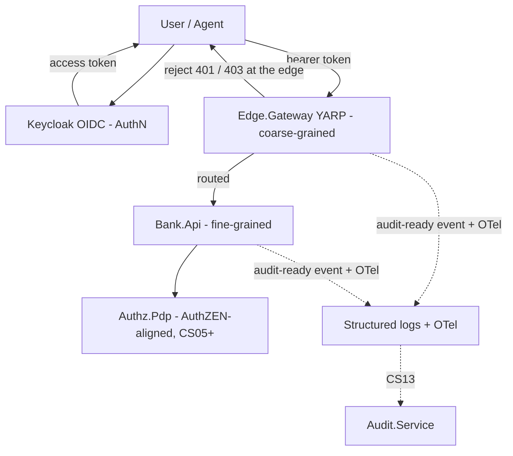

# Coarse- vs. fine-grained authorization boundary

> Reference for the two authorization gates in this system: the coarse-grained
> **Edge.Gateway** (CS04) and the fine-grained **Bank.Api** (CS03, with the
> **Authz.Pdp** arriving in CS05+). Both gates are first-class and complementary —
> see the decision log entry "Coarse- and fine-grained authorization are both
> first-class" in [ARCHITECTURE.md](../../ARCHITECTURE.md).

## Overview

Authorization in this lab is layered. A cheap, stateless **coarse** gate at the
edge rejects whole classes of requests on token facts alone; a contextual
**fine** gate at the service answers the per-resource question the edge cannot.
The two are defence in depth: a request that clears the edge is still fully
re-authorized at `Bank.Api`, so a misrouted or bypassed edge never exposes the
service.

The identity that both gates read is the Keycloak-issued access token from CS03.
Its contract: issuer is the `authz-bank` realm, audience is `bank-api`, `sub` is
the caller's `Bank.Api` user id, `scope` is the space-delimited OAuth scope list
(`bank.read`, `bank.transactions.write`, `bank.approvals.write`), and the custom
claims `tenant` (e.g. `CONTOSO`), `branch`, and `roles` (`Teller`,
`BranchManager`, `ComplianceOfficer`, `Auditor`) carry the domain context.

## Request flow

The client authenticates once at Keycloak, then presents the bearer token to the
edge on every call. The edge validates and coarse-authorizes, then routes to the
service, which fine-authorizes against domain data.

## Why two gates

- **The edge is cheap and stateless.** Token signature, issuer, lifetime,
  audience, the scope a route class needs, and the mere presence of a `tenant`
  claim are all knowable from the token plus the request path and method. No
  database read is required, so the edge can reject a whole class of bad requests
  before they ever reach the service.
- **The service is contextual.** "Does this caller own *this* account?", "is this
  checker different from the maker?", "is the amount over the approval
  threshold?" all require domain state. Those decisions live next to the data, in
  `Bank.Api` today and the `Authz.Pdp` from CS05+.

## Boundary: what each layer enforces

| Authorization concern | Enforced at | Why there |
|---|---|---|
| Token signature / issuer / lifetime | Edge (coarse) **and** `Bank.Api` (defence in depth) | Context-free JWKS/issuer/expiry checks; the cheapest possible reject. Both layers validate so a bypassed edge never exposes the service. |
| Audience `== bank-api` | Edge (coarse) | A token minted for another resource server is rejected before routing. |
| Scope per route class (`bank.read` / `bank.transactions.write` / `bank.approvals.write`) | Edge (coarse); `Bank.Api` re-checks (defence in depth) | The scope a route class needs is known from path + method alone — no domain data. |
| `tenant` claim **presence** | Edge (coarse) | A token with no `tenant` claim can satisfy no tenant-scoped route. Presence only — not *which* tenant. |
| Tenant-to-**resource** match | `Bank.Api` (fine) | Requires loading the resource row to learn its owning tenant; the edge has no database. |
| Role (`Teller` / `BranchManager` / `ComplianceOfficer` / `Auditor`) | `Bank.Api` (fine) | Roles gate specific operations and compose with domain rules; kept beside the data they protect. |
| Maker `== sub`; checker `!= maker` (SoD); approval threshold | `Bank.Api` (fine, domain) | Needs the transaction, the parties, and the `ApprovalThreshold` — pure domain state. |
| Branch-level ABAC | Deferred | The `branch` claim is carried today but nothing enforces it yet; a later ABAC clickstop owns it. |

The scope row is dual-layered on purpose: the edge is the coarse gate, and
`Bank.Api` keeps its own scope check from CS03 as defence in depth (the same
pattern as token validation).

## Coarse gate: Edge.Gateway route → scope map

Every routed request must first clear the **baseline**, regardless of route: a
valid token (signature, issuer, lifetime), audience `bank-api`, and a `tenant`
claim present. On top of the baseline, the edge enforces the scope a route class
needs:

| Route | Coarse requirement beyond the baseline |
|---|---|
| `POST /api/transactions/{id}/approve` | scope `bank.approvals.write` |
| `POST /api/transactions/{id}/reject` | scope `bank.approvals.write` |
| `POST /api/transactions` | scope `bank.transactions.write` |
| `POST /api/accounts` | none beyond baseline — role (`BranchManager`) is enforced fine-grained at `Bank.Api` |
| `GET /api/**` | scope `bank.read` |

`POST /api/accounts` has no dedicated scope because `Bank.Api` gates account
creation by the `BranchManager` role only (a dedicated account-lifecycle scope
arrives with a later authorization clickstop). The edge therefore admits it on
the baseline and leaves the role check to the service.

## What the edge deliberately does not do

The edge does **not** enforce any decision that needs domain data:

- **No role checks.** A role gate often composes with a domain rule (checker
  eligibility, maker eligibility), so it belongs with the data, not at the edge.
- **No tenant-to-resource match.** The edge sees that the token carries *a*
  tenant, not whether that tenant owns the *target row*. Confirming ownership
  needs a database read the edge does not make.
- **No maker-checker, SoD, or approval threshold.** These are pure domain
  decisions over the transaction, its parties, and the `ApprovalThreshold`.

This division is correct because the edge is a cheap, stateless first gate that
rejects whole request classes without touching the database, while the service
answers the contextual, per-resource question the edge structurally cannot.
Nothing the edge skips is left unguarded — the service re-authorizes every
request in full.

## Fine gate: Bank.Api today, Authz.Pdp next

Today (CS03) `Bank.Api` enforces the fine-grained rules inline:

- **Re-validates the token and scope** (defence in depth) via JWT bearer and the
  scope policies in
  [`AuthorizationSetup.cs`](../../src/AuthzEntitlements.Bank.Api/Auth/AuthorizationSetup.cs).
- **Role per operation** — e.g. `BranchManager` to create an account,
  maker-eligible roles to create a transaction, checker-eligible roles
  (`BranchManager` / `ComplianceOfficer`) to decide an approval.
- **Tenant-to-resource match** — the caller's `tenant` claim resolves to a tenant
  id and every read is scoped, every write is checked against the resource's
  tenant; a missing or unknown claim fails closed (see
  [`TenantScope.cs`](../../src/AuthzEntitlements.Bank.Api/Auth/TenantScope.cs)).
- **Maker-checker and SoD** — the maker must equal the token `sub`, the checker
  must equal the token `sub`, and the domain rejects a checker that equals the
  maker (segregation of duties). The `ApprovalThreshold` (10,000) decides whether
  a transaction needs a second person at all.

Next (CS05+), the unified AuthZEN-aligned `Authz.Pdp` becomes the home for the
contextual decision; `Bank.Api` delegates to the PDP instead of deciding inline.
The boundary in this document does not move — only the fine-grained
*implementation* does. Branch-level ABAC remains deferred until its own clickstop.

## Observability: audit-ready decision events

Both gates emit a **structured, audit-ready decision event** (who, what,
allow or deny, and why) plus OpenTelemetry traces and metrics. There is **no live
`Audit.Service` yet**: today the events are structured logs + OTel, and CS13
stands up the append-only, hash-chained `Audit.Service` that ingests them.
Emitting the events in an audit-ready shape now means CS13 is an ingestion change,
not a re-instrumentation of either gate.

## References

- [ARCHITECTURE.md](../../ARCHITECTURE.md) — components, the request-flow diagram,
  and the "both first-class" decision log entry.
- [`src/AuthzEntitlements.Edge.Gateway/`](../../src/AuthzEntitlements.Edge.Gateway/) —
  the coarse gate (CS04).
- [`AuthenticationSetup.cs`](../../src/AuthzEntitlements.Bank.Api/Auth/AuthenticationSetup.cs) —
  JWT bearer issuer/audience/lifetime validation.
- [`AuthorizationSetup.cs`](../../src/AuthzEntitlements.Bank.Api/Auth/AuthorizationSetup.cs)
  and [`ScopeRequirement.cs`](../../src/AuthzEntitlements.Bank.Api/Auth/ScopeRequirement.cs) —
  scope, role, and composite policies.
- [`TenantClaims.cs`](../../src/AuthzEntitlements.Bank.Api/Auth/TenantClaims.cs)
  and [`TenantScope.cs`](../../src/AuthzEntitlements.Bank.Api/Auth/TenantScope.cs) —
  the `tenant` claim and tenant-to-resource resolution.
- [`Endpoints/`](../../src/AuthzEntitlements.Bank.Api/Endpoints/) — the routes and
  the policy each requires.
- [CS04 plan](../../project/clickstops/active/active_cs04_coarse-grained-edge-gateway.md)
  and [CS03 token contract](../../project/clickstops/done/done_cs03_authn-keycloak-oidc.md).
