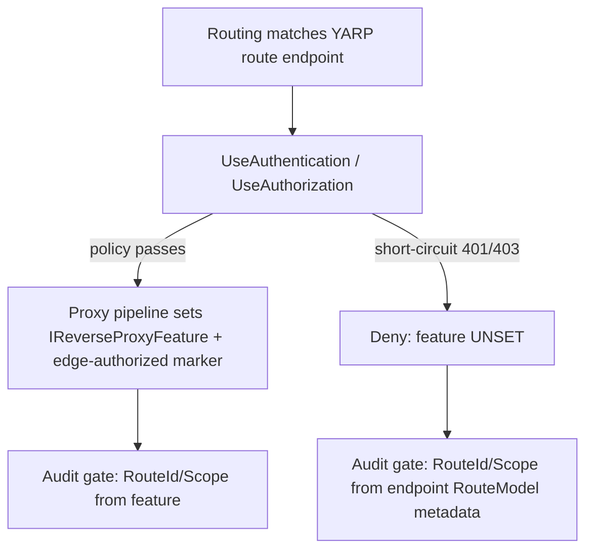

# Audit gates — decision enrichment & non-authz skip contract (LRN-013)

> **Scope:** the two request-wrapping **audit gates** that emit structured
> authorization-*decision* events — the coarse **edge** gate
> ([`GatewayAuditMiddleware`](../../src/AuthzEntitlements.Edge.Gateway/Audit/GatewayAuditMiddleware.cs))
> and the fine-grained **Bank.Api** gate
> ([`BankAuthorizationAuditMiddleware`](../../src/AuthzEntitlements.Bank.Api/Auth/BankAuthorizationAuditMiddleware.cs)).
> This doc defines **which** requests each gate audits and **what** an edge-deny event
> carries. It is distinct from the tamper-evident hash-chained store in
> [audit-pipeline.md](./audit-pipeline.md) (CS13), which *ingests* these events —
> **CS32 changes only what is audited/enriched at the gates; the Audit.Service
> hash-chain is untouched.** Fixes [LEARNINGS.md](../../LEARNINGS.md) `### LRN-013`.

## The two gates

Both gates run as the **outermost** `/api` middleware (before `UseAuthentication` /
`UseAuthorization`), so they observe the **final** status the pipeline produced — including
a `401`/`403` that auth/authz short-circuit. Each emits **one** structured, audit-ready
decision event per audited request.

| Gate | Decides | Its own `401`/`403` means | Allow signal |
|---|---|---|---|
| Edge (`GatewayAuditMiddleware`) | coarse token / audience / scope / tenant | an **edge** deny (short-circuited before the proxy) | the request was forwarded by the YARP proxy pipeline (an edge-authorized marker) |
| Bank.Api (`BankAuthorizationAuditMiddleware`) | fine-grained role / resource-tenant / maker-checker / SoD | a **fine** deny (Bank.Api is the terminal decider) | authorization permitted the matched endpoint to run |

## Non-authz skip contract (both gates)

Only a **genuine authorization decision** is audited. A **routing non-decision** — a path
that matched no route (`404`, no endpoint) or a path that matched but with the wrong method
(`405`, ASP.NET's synthetic *method-not-allowed* endpoint) — is **not** an authz outcome
and is **skipped on both gates**. This keeps the audit trail free of noise that never
reached the authorization layer.

The distinction is drawn off the request pipeline, not the status code alone:

| Case | Edge gate | Bank.Api gate |
|---|---|---|
| Routed / allowed (2xx, or downstream 4xx after forwarding) | **audit** (allow/routed) | **audit** (allow/authorized) |
| Edge / fine `401` (unauthenticated) | **audit** (deny) | **audit** (deny) |
| Edge / fine `403` (forbidden) | **audit** (deny) | **audit** (deny) |
| Business `404`/`409` from a **matched** endpoint | audit (allow/routed) | **audit** (allow) |
| Unmatched path — `404`, **no endpoint** | **skip** | **skip** |
| Method mismatch — `405`, synthetic endpoint | **skip** | **skip** |

- **Edge** keys "was this a decision?" off `ShouldAudit(edgeAuthorized, statusCode)`: audit
  iff the request was forwarded (`edgeAuthorized` marker, set inside the YARP proxy
  pipeline) **or** short-circuited at the edge with `401`/`403`. An unmatched `404` /
  method-mismatch `405` is neither, so it is skipped (already true since CS04; unchanged).
- **Bank.Api** keys off `ShouldAudit(endpointMatched, statusCode)`: audit iff routing
  matched a **real** endpoint **and** the status is not a method-mismatch `405`. This is the
  CS32 addition — previously every non-`401`/`403` status (including an unmatched `404`)
  was recorded as `allow`. A **matched** endpoint that returns a business `404`/`409` is a
  genuine allow and is **still audited**; only the unmatched `404` and the `405` are new
  skips.

> **Why status alone is insufficient:** a business `404` (matched endpoint, resource not
> found — the gate *allowed* the request) and an unmatched `404` (no endpoint — the gate
> never ran) share a status code but are opposite audit outcomes. The matched-endpoint
> signal (`context.GetEndpoint()`) separates them.

## Edge-denial enrichment — RouteId & RequiredScope (the LRN-013 gap)

An edge-deny audit event must carry the **matched route's** `RouteId` and its
`RequiredScope`, so an operator can see *which coarse route* and *which scope* a denied
caller was missing. The pre-CS32 gate read these from YARP's
`IReverseProxyFeature.Route.Config` — but that feature is set **inside the proxy pipeline**,
which never runs on a short-circuit `401`/`403` deny (`UseAuthorization` short-circuits
first). So **edge-deny events had null `RouteId`/`RequiredScope`** — the LRN-013 gap.

**Fix:** resolve the route config from the two sources in priority order —

```
proxyFeature?.Route.Config          // present on an edge allow/routed (proxy ran)
  ?? endpoint?.Metadata.GetMetadata<RouteModel>()?.Config   // fallback on a short-circuit deny
```

Routing runs **before** authorization, so even on a short-circuit deny the matched YARP
route endpoint — and the `RouteModel` that
[`ProxyEndpointFactory`](https://github.com/dotnet/yarp/blob/v2.3.0/src/ReverseProxy/Routing/ProxyEndpointFactory.cs)
attaches to endpoint metadata (`endpointBuilder.Metadata.Add(route)`) — is still on the
`HttpContext` when the audit gate reads it after `await next`. The allow/routed path is
**unchanged**: when the proxy feature is present it wins, so the fallback only fills the
short-circuit-deny gap. A `RouteModel` is absent from the synthetic `405` endpoint and from
an unmatched `404` (null endpoint), so both resolve to `(null, null)` — but those are
skipped by the non-authz contract before enrichment runs, so a non-decision never produces
an event.



### Policy → scope mapping

`RequiredScope` is derived from the matched route's coarse `AuthorizationPolicy`
(`coarse.read` → `bank.read`, `coarse.transactions.write` → `bank.transactions.write`,
`coarse.approvals.write` → `bank.approvals.write`). The `coarse.authenticated` policy has
no required scope (authenticated + tenant only), so its `RequiredScope` is `null` by design.

## Invariants (what CS32 does **not** change)

- **Authorization decisions are unchanged.** CS32 changes only which requests are *audited*
  and enriches edge-deny events; no coarse or fine allow/deny outcome changes.
- **The audit hash-chain is untouched.** These are producer-side gate events; the
  Audit.Service append-only hash-chain ([audit-pipeline.md](./audit-pipeline.md)) is not
  modified.
- **Fail-safe enrichment.** When neither source yields a route config, the fields are
  `null` rather than fabricated.

## Tests

- Edge enrichment (pure): `ResolveRouteMetadata` precedence + short-circuit fallback +
  `(null, null)` for the `404`/`405` non-decisions —
  [`GatewayAuditTests`](../../tests/AuthzEntitlements.Edge.Gateway.Tests/GatewayAuditTests.cs).
- Edge enrichment (middleware): a real `401`/`403` short-circuit deny emits an event
  carrying `RouteId`/`RequiredScope` recovered from endpoint metadata —
  [`GatewayAuditEnrichmentTests`](../../tests/AuthzEntitlements.Edge.Gateway.Tests/GatewayAuditEnrichmentTests.cs).
- Bank.Api skip (pure): `ShouldAudit` matrix (matched vs unmatched × status) —
  [`BankAuthorizationAuditTests`](../../tests/AuthzEntitlements.Bank.Api.Tests/BankAuthorizationAuditTests.cs).
- Bank.Api skip (middleware): unmatched `404` / `405` emit **no** event; matched allow /
  `401` / `403` / business `404` each emit one —
  [`BankAuthorizationAuditSkipTests`](../../tests/AuthzEntitlements.Bank.Api.Tests/BankAuthorizationAuditSkipTests.cs).

## References

- [LEARNINGS.md](../../LEARNINGS.md) — `### LRN-013` (the two edge-audit follow-ups).
- [`GatewayAuditMiddleware.cs`](../../src/AuthzEntitlements.Edge.Gateway/Audit/GatewayAuditMiddleware.cs)
  — `ShouldAudit`, `ResolveRouteMetadata`.
- [`BankAuthorizationAuditMiddleware.cs`](../../src/AuthzEntitlements.Bank.Api/Auth/BankAuthorizationAuditMiddleware.cs)
  — `ShouldAudit`, `ClassifyDecision`.
- [audit-pipeline.md](./audit-pipeline.md) — the CS13 tamper-evident store these events feed.
