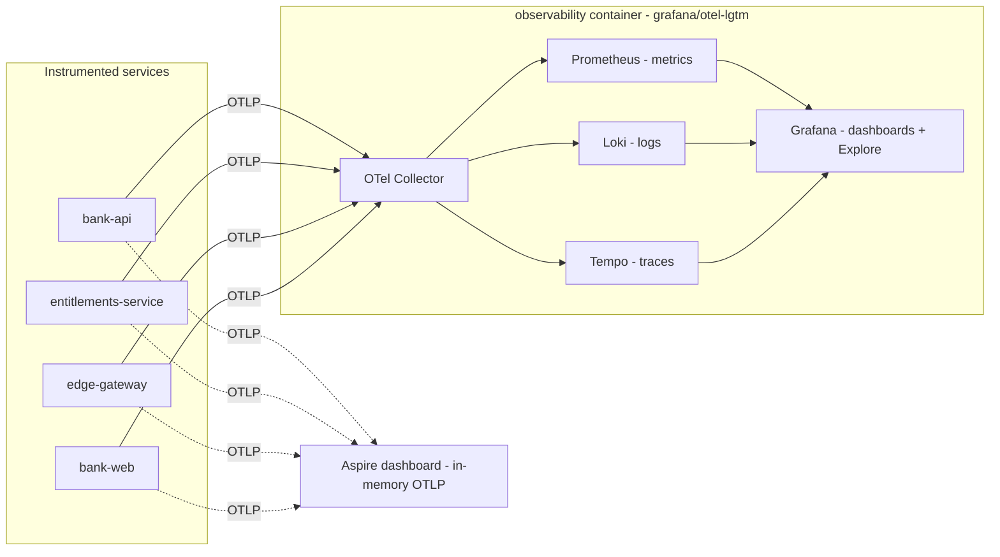

# Persistent observability stack

> **Scope:** the CS12 persistent observability backend — a bundled Grafana stack
> (OTel Collector + Prometheus + Loki + Tempo + Grafana) that receives OpenTelemetry
> from the instrumented services. See [ARCHITECTURE.md](../../ARCHITECTURE.md) phase 4
> (Observability + audit) and the CS12 plan
> (`../../project/clickstops/done/done_cs12_observability-stack.md`).

The .NET Aspire dashboard already shows metrics, logs, and traces, but only for the
lifetime of a single `aspire run`: its telemetry store is in-memory and ephemeral. This
stack goes **beyond the dev-time dashboard** by persisting metrics, logs, and traces in a
Grafana stack that survives restarts, so a developer can inspect service health, request
rates, and distributed traces across sessions. It is the phase-4 observability layer of the
architecture (see [ARCHITECTURE.md](../../ARCHITECTURE.md)); the tamper-evident authorization
**audit** trail is a separate concern owned by CS13 (see
[Relationship to the authorization audit](#relationship-to-the-authorization-audit-cs13)).

## Topology

The instrumented services **dual-export** (CS60) OpenTelemetry over OTLP to two targets at
once: the **Aspire dashboard's** in-memory OTLP receiver (a live view for the lifetime of a
single `aspire run`) and the persistent **lgtm collector**, which fans each signal out to its
store so Grafana can visualize it across sessions. Exactly **one** collector runs per
`aspire run` — CS60 dropped the persistent lifetime (see
[Why `grafana/otel-lgtm`](#why-grafanaotel-lgtm-the-bundle)) — and all of its components run
inside a **single** container image, `grafana/otel-lgtm`.



- **Instrumented services** — `bank-api`, `entitlements-service`, `edge-gateway`, and
  `bank-web` (plus `audit-service`, `authz-pdp`, `governance-service` — 7 in all) export
  traces, metrics, and logs via the shared ServiceDefaults OTel wiring, to **both** targets.
- **Aspire dashboard** — the in-memory OTLP receiver Aspire auto-wires via
  `OTEL_EXPORTER_OTLP_ENDPOINT`; ephemeral, for the lifetime of one `aspire run`.
- **OTel Collector** — the single per-run OTLP ingest point (gRPC `4317` / HTTP `4318`),
  driven by the AppHost-injected `LGTM_OTLP_ENDPOINT`.
- **Prometheus / Loki / Tempo** — the metrics / logs / traces stores.
- **Grafana** — dashboards and the Explore views over all three stores.

## Why `grafana/otel-lgtm` (the bundle)

The stack ships as one image, `grafana/otel-lgtm:0.28.0`, rather than five hand-wired
containers. That single image bundles all five deliverable components — the **OTel
Collector**, **Prometheus**, **Tempo**, **Loki**, and **Grafana** — pre-wired with Grafana
datasources so metrics, logs, and traces are queryable out of the box. It is the standard
Aspire persistent-observability backend for **dev / demo / test** loops.

This is deliberately **not** a production observability deployment: the AppHost is a
dev-loop orchestrator, so the bundle trades production-grade scaling and retention for a
robust, reproducible, single-resource backend. Two choices keep it deterministic and
durable across runs:

- **Pinned tag `0.28.0`** — a fixed tag (not `latest`) for reproducible runs, matching the
  repo's version-pinning convention.
- **Single per-run collector + persistent `/data` volume** — CS60 **dropped**
  `ContainerLifetime.Persistent`, so exactly **one** collector exists per `aspire run` and is
  auto-removed on shutdown. (Persistent + dynamic-port containers were accumulating across
  runs and checkouts, causing collector/Grafana split-brain — see
  [Stale-collector cleanup](#stale-collector-cleanup).) The named `authz-observability-data`
  `/data` volume still persists collected telemetry across runs, so history survives even
  though the container itself does not.

## Endpoints

| Signal / UI | Container port | Aspire endpoint name |
|---|---|---|
| Grafana UI | `3000` | `grafana` (external) |
| OTLP gRPC | `4317` | `otlp-grpc` (internal) |
| OTLP HTTP | `4318` | `otlp-http` (internal) |
| Prometheus read API | `9090` | `prometheus` (internal) |

Only the Grafana UI is exposed off-box: `WithExternalHttpEndpoints()` marks just the `grafana`
endpoint external, while the OTLP-ingest and Prometheus ports are modelled as internal `tcp`
endpoints — reachable by the host-run services and the e2e guard, but not a
telemetry-injection surface. The `prometheus` (9090) read API (CS60) lets the
telemetry-arrival e2e guard query the collector directly and lets operators run PromQL without
opening Grafana.

Open Grafana by clicking the `observability` resource's `grafana` endpoint in the Aspire
dashboard. Grafana **anonymous access is enabled** (`GF_AUTH_ANONYMOUS_ENABLED=true`, with
the anonymous org role set to `Editor`) so no login is needed in the lab — the endpoint opens
straight into the dashboards and Explore. The default `admin/admin` account cannot be used to
escalate: both the **UI login form** (`GF_AUTH_DISABLE_LOGIN_FORM=true`) and **HTTP Basic Auth**
(`GF_AUTH_BASIC_ENABLED=false`) are disabled, so there is no interactive or programmatic path
from anonymous Editor to admin. This frictionless access is a lab convenience, not a production
posture.

## How services are wired

The AppHost registers the stack as a container resource named `observability`:

```csharp
builder.AddContainer("observability", "grafana/otel-lgtm", "0.28.0")
```

(see [`AppHost.cs`](../../src/AuthzEntitlements.AppHost/AppHost.cs)). Each instrumented
service gets a `WaitFor(observability)` so it starts only once the collector is ready, plus a
`LGTM_OTLP_ENDPOINT` env var pointing at the container's `otlp-grpc` endpoint. Crucially the
AppHost **no longer overrides** `OTEL_EXPORTER_OTLP_ENDPOINT` (CS60): Aspire keeps that
pointed at its **own dashboard** OTLP receiver, so telemetry keeps reaching the dashboard, and
the lgtm collector is wired as a *second*, separate target via `LGTM_OTLP_ENDPOINT`.

`ConfigureOpenTelemetry` / `AddOpenTelemetryExporters` in
[`Extensions.cs`](../../src/AuthzEntitlements.ServiceDefaults/Extensions.cs) implement the
**dual-export** (CS60). For each signal — metrics, traces, and logs — they register **two**
OTLP exporters: a config-free `AddOtlpExporter()` that reads Aspire's auto-injected
`OTEL_EXPORTER_OTLP_ENDPOINT` (+ `OTEL_EXPORTER_OTLP_HEADERS`) → the **Aspire dashboard**, and
a second `AddOtlpExporter()` explicitly pointed at `LGTM_OTLP_ENDPOINT` → the **lgtm
collector**. (`UseOtlpExporter()` — the old single-target helper — is **not** used, because it
cannot be combined with the per-signal `AddOtlpExporter()` the second target requires.) Each
leg is independent and gated on its env var, so if either is empty that leg simply stays off.

The result is that operational telemetry now lands in **both** places at once (CS60): the
**Aspire dashboard's** Structured logs / Traces / Metrics tabs give a reliable live view for
the lifetime of a single `aspire run`, and the persistent **Grafana** stack gives dashboards
and cross-session history. Because the dashboard always receives telemetry, a developer keeps a
working view even if the persistent Grafana they open is not the instance receiving data — the
split-brain that made the pre-CS60 empty-Grafana confusion possible. Earlier revisions of this
doc described the "home of telemetry" *moving* to Grafana with dual-export as a mere "future
enhancement"; that is now superseded — **dual-export is implemented here**.

## Baseline dashboards

Two dashboards are provisioned into Grafana from `infra/observability/` via bind-mounts:

- `infra/observability/grafana/dashboards-provisioning.yaml` is mounted at
  `/otel-lgtm/grafana/conf/provisioning/dashboards/custom.yaml` (the Grafana dashboard
  provider that points Grafana at the custom-dashboards directory).
- `infra/observability/grafana/dashboards/service-health.json` and `request-rates.json` are
  mounted into `/otel-lgtm/grafana/conf/provisioning/dashboards/custom/`.

### Service Health

A RED-style operational overview grouped by service: request **rate**, **error rate** (5xx),
request-duration **p95 / p99**, and **active (in-flight) requests**, alongside a best-effort
.NET runtime panel (GC collections). It answers "is
each service healthy and how hard is it working?" at a glance.

### Request Rates

Request **throughput** broken down by service (the `job` label), status code, HTTP route, and
HTTP method, plus a top-routes table. It answers "where is traffic going, and what is the
shape of the responses?"

Both dashboards query the OTel→Prometheus-normalised ASP.NET Core metric
`http_server_request_duration_seconds_*` (a histogram exposed as `_count`, `_sum`, and
`_bucket` series); the Service Health board additionally uses `http_server_active_requests` and
a best-effort .NET GC-collections metric. **Prometheus is otel-lgtm's default Grafana
datasource**, and the OTel resource attribute `service.name` surfaces as the Prometheus `job`
label, which is how the panels group and filter by service.

## Run and verify

1. Run the AppHost with `aspire run` from `src/AuthzEntitlements.AppHost`.
2. **Drive some traffic first.** The dashboards are entirely `http_server_*`-based (RED:
   rate / errors / duration), so an **idle** stack shows empty panels *by design* — they only
   populate once inbound requests have been served. Send a handful of authenticated and
   rejected calls through the edge gateway / `bank-api` using the CS03/CS04 sign-in-then-call
   flow (see the
   [coarse-vs-fine boundary](../architecture/coarse-vs-fine-boundary.md) doc for the request
   path); any mix of successful and rejected calls is enough.
3. **Verify in Grafana.** Open the `observability` resource's `grafana` endpoint and confirm
   the **Service Health** and **Request Rates** dashboards show data; use **Explore → Tempo**
   for traces and **Explore → Loki** for logs.
4. **Verify in the Aspire dashboard (dual-export).** The same telemetry also lands in the
   Aspire dashboard's **Structured logs**, **Traces**, and **Metrics** tabs — not just console
   logs — because services export to the dashboard too (CS60). This stays a reliable view even
   when the persistent Grafana stack is not up.

If a dashboard is empty, first drive **more** traffic (idle → empty is expected). If it is
still empty after real traffic, confirm the service received an injected `LGTM_OTLP_ENDPOINT`
(the collector leg) and/or `OTEL_EXPORTER_OTLP_ENDPOINT` (the dashboard leg) — each leg is
gated on its env var and stays off when empty.

For an automated guard, the opt-in `RUN_ASPIRE_E2E=1` telemetry-arrival test
([`TelemetryArrivalE2ETests`](../../tests/AuthzEntitlements.E2E.Tests/TelemetryArrivalE2ETests.cs))
boots the stack, drives `/alive` traffic to **every** project service, and asserts that each
service's `http_server_request_duration_seconds_count` `job` series receives a **new sample this
run** — it compares `max by (job)(timestamp(...))` against a pre-traffic baseline and requires the
latest-sample timestamp to advance (CS61). Comparing sample timestamps (not counter values) is
robust to the persistent volume's stale series: a per-process counter reset or a stale series aging
out of Prometheus's lookback cannot masquerade as this-run delivery. It is the exact metric the
dashboards query, so per-service telemetry delivery cannot silently regress.

## Persistence (verified)

The telemetry disk is the named **`authz-observability-data`** volume mounted at **`/data`**, which
holds every store (`prometheus/`, `loki/`, `tempo/`, `grafana/`, `pyroscope/`). Dropping
`ContainerLifetime.Persistent` (CS60) does **not** lose history: the **volume** — not the container
lifetime — is what persists telemetry. Verified with a two-run test (CS61): run A drove traffic to
`sum(http_server_request_duration_seconds_count)` = 287; the AppHost was stopped and the container
**removed**; run B booted a **fresh** container reusing the volume and reported the same **287
before any new traffic** — so telemetry survives container recreation. A Docker-free app-model smoke
test ([`AppHostApplicationModelSmokeTests`](../../tests/AuthzEntitlements.AppHost.Tests/AppHostApplicationModelSmokeTests.cs))
asserts the named, writable `/data` volume mount so it cannot be silently dropped or swapped.

> **Note.** A *hard kill* of the AppHost orphans the run-scoped collector (leaves it running)
> instead of removing it; normal Ctrl+C removal is assumed, and the
> [Stale-collector cleanup](#stale-collector-cleanup) covers any orphans. The telemetry data is
> unaffected — it lives in the volume.

## Stale-collector cleanup

Before CS60 the `observability` container used `ContainerLifetime.Persistent` with dynamic
host ports, so `otel-lgtm` containers could **accumulate** across runs and checkouts
(different config hashes, surviving shutdown). A developer could then open a **stale**
instance's Grafana — empty, because the *current* run exported to a different instance
(collector/Grafana split-brain). CS60 fixes the wiring going forward (one collector per run,
auto-removed on shutdown), but a machine that ran the pre-CS60 stack may still carry leftover
containers. Remove them so the machine converges to a single collector:

```powershell
# remove any leftover/duplicate otel-lgtm containers (running or stopped)
$ids = docker ps -aq --filter "ancestor=grafana/otel-lgtm:0.28.0"
if ($ids) { docker rm -f $ids }

# optional — also drop the persistent volume for a fully clean slate (loses history).
# ignore a "no such volume" error if it is already gone.
docker volume rm authz-observability-data
```

Keep the named `authz-observability-data` volume in normal use — it is how telemetry history
persists across runs. Drop it only for a completely fresh collector: a persistent `/data`
volume can surface **stale series** from earlier runs.

## Config file map

The stack's configuration lives under `infra/observability/`. Edit these files to change the
provisioned dashboards or the provider wiring:

| File | Container mount target | Purpose |
|---|---|---|
| `infra/observability/grafana/dashboards-provisioning.yaml` | `/otel-lgtm/grafana/conf/provisioning/dashboards/custom.yaml` | Grafana dashboard-provider config |
| `infra/observability/grafana/dashboards/service-health.json` | `/otel-lgtm/grafana/conf/provisioning/dashboards/custom/` | Service Health dashboard |
| `infra/observability/grafana/dashboards/request-rates.json` | `/otel-lgtm/grafana/conf/provisioning/dashboards/custom/` | Request Rates dashboard |

## Relationship to the authorization audit (CS13)

This stack is **operational telemetry** — metrics, logs, and traces for debugging and
health. It is distinct from the tamper-evident **authorization audit** pipeline that CS13
will build. The structured authorization-decision events emitted by the coarse edge gate
(CS04) and the entitlements service (CS10) are **audit records**, not this OTel telemetry:
they are emitted in an audit-ready shape today and CS13 stands up the append-only,
hash-chained store that ingests them (see the audit-ready decision-events note in the
[coarse-vs-fine boundary](../architecture/coarse-vs-fine-boundary.md) doc and
[ARCHITECTURE.md](../../ARCHITECTURE.md)). The two pipelines stay separate: telemetry answers
"is the system healthy?"; the audit trail answers "who was allowed to do what, and why?"

## Known issue — LRN-014 (empty-body 500 under `aspire run`)

[LEARNINGS.md](../../LEARNINGS.md) **LRN-014** records an issue where `Bank.Api` returned
an empty-body HTTP 500 on every request under `aspire run`, suspected to be an Aspire/OTLP
export interaction (the same service served correctly when run standalone without the
Aspire-injected OTLP env). **CS32 triaged this** — see
[aspire-run-500-triage.md](./aspire-run-500-triage.md): the OTLP exporter is proven
**request-path isolated** (an unreachable collector cannot 500 a request), all OTLP-exporting
services already declare `WaitFor(observability)` (7/7), and the most-likely root cause is an
early release-candidate environmental interaction now mitigated by the current toolchain plus
the CS12 real collector. The full clean `aspire run` telemetry-arrival confirmation that
LRN-014 left outstanding is now **closed** by the CS60 e2e guard
([`TelemetryArrivalE2ETests`](../../tests/AuthzEntitlements.E2E.Tests/TelemetryArrivalE2ETests.cs),
opt-in `RUN_ASPIRE_E2E=1`), which boots the full stack, drives traffic, and asserts telemetry
arrives in the collector's Prometheus.

## References

- [ARCHITECTURE.md](../../ARCHITECTURE.md) — the `OTel Collector -> Grafana/Prometheus/Loki/Tempo`
  topology and the phase-4 observability + audit note.
- [`src/AuthzEntitlements.AppHost/AppHost.cs`](../../src/AuthzEntitlements.AppHost/AppHost.cs) —
  the `observability` container resource and the per-service OTLP wiring.
- [`src/AuthzEntitlements.ServiceDefaults/Extensions.cs`](../../src/AuthzEntitlements.ServiceDefaults/Extensions.cs) —
  `ConfigureOpenTelemetry` / `AddOpenTelemetryExporters`, gated on `OTEL_EXPORTER_OTLP_ENDPOINT`.
- [coarse-vs-fine boundary](../architecture/coarse-vs-fine-boundary.md) — audit-ready decision
  events vs. OTel telemetry.
- [aspire-run-500-triage.md](./aspire-run-500-triage.md) — the CS32 LRN-014 triage:
  root-cause analysis, offline evidence, mitigation state, and the full-run confirmation runbook.
- [CS12 plan](../../project/clickstops/done/done_cs12_observability-stack.md) — deliverables,
  exit criteria, and design decisions D1–D5.
