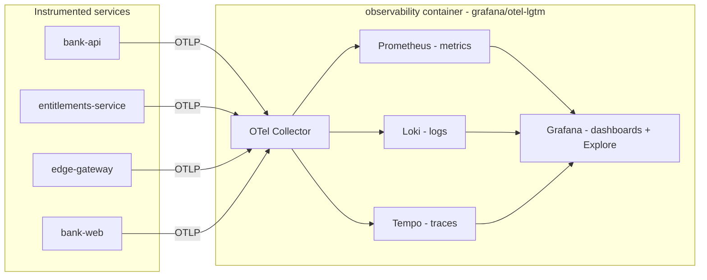

# Persistent observability stack

> **Scope:** the CS12 persistent observability backend — a bundled Grafana stack
> (OTel Collector + Prometheus + Loki + Tempo + Grafana) that receives OpenTelemetry
> from the instrumented services. See [ARCHITECTURE.md](../../ARCHITECTURE.md) phase 4
> (Observability + audit) and the CS12 plan
> (`../../project/clickstops/active/active_cs12_observability-stack.md`).

The .NET Aspire dashboard already shows metrics, logs, and traces, but only for the
lifetime of a single `aspire run`: its telemetry store is in-memory and ephemeral. This
stack goes **beyond the dev-time dashboard** by persisting metrics, logs, and traces in a
Grafana stack that survives restarts, so a developer can inspect service health, request
rates, and distributed traces across sessions. It is the phase-4 observability layer of the
architecture (see [ARCHITECTURE.md](../../ARCHITECTURE.md)); the tamper-evident authorization
**audit** trail is a separate concern owned by CS13 (see
[Relationship to the authorization audit](#relationship-to-the-authorization-audit-cs13)).

## Topology

The instrumented services export OpenTelemetry over OTLP to a collector, which fans each
signal out to its store; Grafana reads all three stores for visualization. Every component
below runs inside a **single** container image, `grafana/otel-lgtm` (see
[Why `grafana/otel-lgtm`](#why-grafanaotel-lgtm-the-bundle)).



- **Instrumented services** — `bank-api`, `entitlements-service`, `edge-gateway`, and
  `bank-web` export traces, metrics, and logs via the shared ServiceDefaults OTel wiring.
- **OTel Collector** — the single OTLP ingest point (gRPC `4317` / HTTP `4318`).
- **Prometheus / Loki / Tempo** — the metrics / logs / traces stores.
- **Grafana** — dashboards and the Explore views over all three stores.

## Why `grafana/otel-lgtm` (the bundle)

The stack ships as one image, `grafana/otel-lgtm:0.28.0`, rather than five hand-wired
containers. That single image bundles all five deliverable components — the **OTel
Collector**, **Prometheus**, **Tempo**, **Loki**, and **Grafana** — pre-wired with Grafana
datasources so metrics, logs, and traces are queryable out of the box. It is the standard
Aspire persistent-observability backend for **dev / demo / test** loops.

This is deliberately **not** a production observability deployment: the AppHost is a
dev-loop orchestrator, so the bundle trades production-grade scaling and retention for a
robust, reproducible, single-resource backend. Two choices keep it deterministic and
durable across runs:

- **Pinned tag `0.28.0`** — a fixed tag (not `latest`) for reproducible runs, matching the
  repo's version-pinning convention.
- **Persistent lifetime + `/data` volume** — the container uses a persistent lifetime and a
  `/data` volume, so collected telemetry survives `aspire run` restarts instead of being
  discarded with the process.

## Endpoints

| Signal / UI | Container port | Aspire endpoint name |
|---|---|---|
| Grafana UI | `3000` | `grafana` (external) |
| OTLP gRPC | `4317` | `otlp-grpc` |
| OTLP HTTP | `4318` | `otlp-http` |

Open Grafana by clicking the `observability` resource's `grafana` endpoint in the Aspire
dashboard. Grafana **anonymous access is enabled** (`GF_AUTH_ANONYMOUS_ENABLED=true`, with
the anonymous org role set to `Editor`) so no login is needed in the lab — the endpoint opens
straight into the dashboards and Explore. This frictionless access is a lab convenience, not
a production posture.

## How services are wired

The AppHost registers the stack as a container resource named `observability`:

```csharp
builder.AddContainer("observability", "grafana/otel-lgtm", "0.28.0")
```

(see [`AppHost.cs`](../../src/AuthzEntitlements.AppHost/AppHost.cs)). Each instrumented
service then gets its `OTEL_EXPORTER_OTLP_ENDPOINT` set to the container's `otlp-grpc`
endpoint and a `WaitFor(observability)` so it starts only once the collector is ready.

No ServiceDefaults code change is needed. `ConfigureOpenTelemetry` and
`AddOpenTelemetryExporters` in
[`Extensions.cs`](../../src/AuthzEntitlements.ServiceDefaults/Extensions.cs) already call
`UseOtlpExporter()` **only when** `OTEL_EXPORTER_OTLP_ENDPOINT` is non-empty. Injecting that
env var from the AppHost is therefore all it takes for the existing wiring to **fan out** to
the persistent collector.

With this in place the **home of telemetry moves to Grafana** — the phase-4 goal of going
"beyond the dev-time Aspire dashboard". The Aspire dashboard still shows resource state and
console logs, so it remains the place to watch orchestration health; the rich metrics, logs,
and traces now persist in the Grafana stack. Simultaneously exporting to **both** the Aspire
dashboard and the lgtm collector (dual-export) is a possible future enhancement and is **not**
implemented here.

## Baseline dashboards

Two dashboards are provisioned into Grafana from `infra/observability/` via bind-mounts:

- `infra/observability/grafana/dashboards-provisioning.yaml` is mounted at
  `/otel-lgtm/grafana/conf/provisioning/dashboards/custom.yaml` (the Grafana dashboard
  provider that points Grafana at the custom-dashboards directory).
- `infra/observability/grafana/dashboards/service-health.json` and `request-rates.json` are
  mounted into `/otel-lgtm/grafana/conf/provisioning/dashboards/custom/`.

### Service Health

A RED-style operational overview grouped by service: request **rate**, **error rate** (5xx),
request-duration **p95 / p99**, and **active (in-flight) requests**, alongside a best-effort
.NET runtime panel (GC collections). It answers "is
each service healthy and how hard is it working?" at a glance.

### Request Rates

Request **throughput** broken down by service (the `job` label), status code, HTTP route, and
HTTP method, plus a top-routes table. It answers "where is traffic going, and what is the
shape of the responses?"

Both dashboards query the OTel→Prometheus-normalised ASP.NET Core metric
`http_server_request_duration_seconds_*` (a histogram exposed as `_count`, `_sum`, and
`_bucket` series); the Service Health board additionally uses `http_server_active_requests` and
a best-effort .NET GC-collections metric. **Prometheus is otel-lgtm's default Grafana
datasource**, and the OTel resource attribute `service.name` surfaces as the Prometheus `job`
label, which is how the panels group and filter by service.

## Run and verify

1. Run the AppHost with `aspire run` from `src/AuthzEntitlements.AppHost`.
2. Open the Aspire dashboard, then open the `observability` resource's `grafana` endpoint.
3. Drive some traffic through the edge gateway / `bank-api` — a couple of authenticated
   requests, using the same CS03/CS04 sign-in-then-call flow the lab uses elsewhere (see the
   [coarse-vs-fine boundary](../architecture/coarse-vs-fine-boundary.md) doc for the request
   path). Any handful of successful and rejected calls is enough to populate the panels.
4. In Grafana, confirm the **Service Health** and **Request Rates** dashboards show data.
5. Use **Explore → Tempo** to confirm traces are arriving, and **Explore → Loki** to confirm
   logs are arriving.

If a dashboard is empty, generate more traffic and confirm the service actually received an
injected `OTEL_EXPORTER_OTLP_ENDPOINT` (otherwise ServiceDefaults leaves the OTLP exporter
off by design).

## Config file map

The stack's configuration lives under `infra/observability/`. Edit these files to change the
provisioned dashboards or the provider wiring:

| File | Container mount target | Purpose |
|---|---|---|
| `infra/observability/grafana/dashboards-provisioning.yaml` | `/otel-lgtm/grafana/conf/provisioning/dashboards/custom.yaml` | Grafana dashboard-provider config |
| `infra/observability/grafana/dashboards/service-health.json` | `/otel-lgtm/grafana/conf/provisioning/dashboards/custom/` | Service Health dashboard |
| `infra/observability/grafana/dashboards/request-rates.json` | `/otel-lgtm/grafana/conf/provisioning/dashboards/custom/` | Request Rates dashboard |

## Relationship to the authorization audit (CS13)

This stack is **operational telemetry** — metrics, logs, and traces for debugging and
health. It is distinct from the tamper-evident **authorization audit** pipeline that CS13
will build. The structured authorization-decision events emitted by the coarse edge gate
(CS04) and the entitlements service (CS10) are **audit records**, not this OTel telemetry:
they are emitted in an audit-ready shape today and CS13 stands up the append-only,
hash-chained store that ingests them (see the audit-ready decision-events note in the
[coarse-vs-fine boundary](../architecture/coarse-vs-fine-boundary.md) doc and
[ARCHITECTURE.md](../../ARCHITECTURE.md)). The two pipelines stay separate: telemetry answers
"is the system healthy?"; the audit trail answers "who was allowed to do what, and why?"

## Known issue — LRN-014 (empty-body 500 under `aspire run`)

[LEARNINGS.md](../../LEARNINGS.md) **LRN-014** records an open issue where `Bank.Api` returned
an empty-body HTTP 500 on every request under `aspire run`, suspected to be an Aspire/OTLP
export interaction (the same service served correctly when run standalone without the
Aspire-injected OTLP env). Because CS12 introduces a real OTLP collector, it is the candidate
**triage home** for LRN-014: whether routing service OTLP at the lgtm collector changes that
behaviour is a question this stack lets us test. This issue is **not** claimed fixed here; the
orchestrator records triage findings at CS12 close-out.

## References

- [ARCHITECTURE.md](../../ARCHITECTURE.md) — the `OTel Collector -> Grafana/Prometheus/Loki/Tempo`
  topology and the phase-4 observability + audit note.
- [`src/AuthzEntitlements.AppHost/AppHost.cs`](../../src/AuthzEntitlements.AppHost/AppHost.cs) —
  the `observability` container resource and the per-service OTLP wiring.
- [`src/AuthzEntitlements.ServiceDefaults/Extensions.cs`](../../src/AuthzEntitlements.ServiceDefaults/Extensions.cs) —
  `ConfigureOpenTelemetry` / `AddOpenTelemetryExporters`, gated on `OTEL_EXPORTER_OTLP_ENDPOINT`.
- [coarse-vs-fine boundary](../architecture/coarse-vs-fine-boundary.md) — audit-ready decision
  events vs. OTel telemetry.
- [CS12 plan](../../project/clickstops/active/active_cs12_observability-stack.md) — deliverables,
  exit criteria, and design decisions D1–D5.
