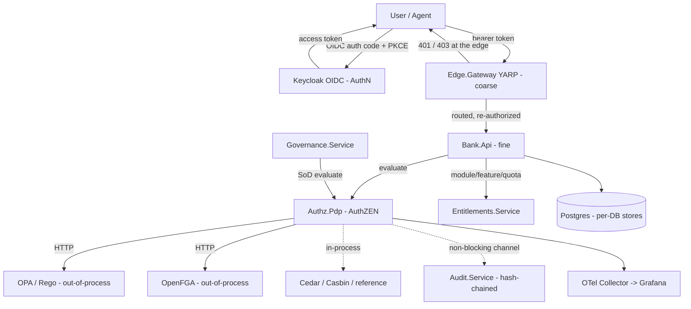

# STRIDE threat model — AuthZ & Entitlements Lab

> **Scope:** a rigorous STRIDE threat model for the authorization system itself —
> the AuthN edge, the coarse gateway, the fine-grained PDP and its engines, the
> entitlements/governance services, and the tamper-evident audit log. It records
> the **shipped** security controls (with verified `file:line` citations), the
> **residual risk** each leaves, and the **tracked follow-on** hardening. It is the
> CS18 deliverable and builds on the boundary, identity, PDP, policy-lifecycle, and
> audit docs referenced in [§ References](#references).

## Status & scope

- **As of:** CS18 (security hardening + threat model). See
  [`active_cs18_security-hardening-threat-model.md`](../../project/clickstops/active/active_cs18_security-hardening-threat-model.md).
- **System class:** a **local-first developer / evaluation lab** and reusable
  reference architecture — **not** a production deployment. It runs under the
  .NET Aspire AppHost on a single developer machine
  ([`AppHost.cs`](../../src/AuthzEntitlements.AppHost/AppHost.cs)). Every
  "dev-only" caveat in this document is intentional lab ergonomics, not a
  shipped production posture.
- **What this model covers:** the authorization/entitlements control plane and
  its trust boundaries. It does **not** re-derive the fintech domain model; it
  threat-models the *decisions* the system makes and the *evidence* it keeps.
- **How to read the tables:** each STRIDE category lists concrete threats, the
  **existing mitigation** (with a citation you can open and verify), the
  **residual risk** the mitigation leaves, and any **tracked follow-on**. A
  control is only claimed where the code backs it — where a control does *not*
  exist (e.g. cryptographic policy signing), it is listed as residual risk, not
  overstated.

### Dev-vs-prod at a glance

The lab deliberately relaxes several production controls so it stays offline,
reproducible, and Docker-optional. These are called out in full in
[§ Assumptions & the dev-vs-prod boundary](#assumptions--the-dev-vs-prod-boundary)
and in [`secrets-and-least-privilege.md`](secrets-and-least-privilege.md); they
are flagged inline in the STRIDE tables as **(dev-only)** so a production adopter
can find every one.

## System overview & assets

The lab exercises four complementary authorization layers — AuthN, coarse-grained
edge, fine-grained PDP, and entitlements — over a fintech back-office domain
(accounts, transactions, maker-checker approvals, segregation of duties). See
[ARCHITECTURE.md](../../ARCHITECTURE.md) for the component catalog and the
request-flow graph.

### Components

| Component | Role | Trust posture |
|---|---|---|
| Keycloak (OIDC) | Identity provider; mints access tokens | External IdP; the root of the identity trust chain |
| Edge.Gateway (YARP) | Coarse gate: token + audience + scope + tenant-presence | First, stateless gate; forwards to Bank.Api |
| Bank.Api | Fintech domain API; fine-grained authorization | Re-authorizes every request (defence in depth) |
| Bank.Web (Blazor) | UI: fintech workflows, AuthZ playground, audit explorer | Confidential OIDC client |
| Authz.Pdp | Unified AuthZEN-aligned PDP + engine adapters | Decision point consumed by Bank.Api and Governance |
| Engines (reference / ASP.NET / Casbin / Cedar in-process; OPA / OpenFGA out-of-process) | Policy evaluation | In-process engines are trusted code; OPA/OpenFGA cross a process boundary |
| Entitlements.Service | Commercial entitlements (plans/features/quotas) | Consulted fail-closed by Bank.Api |
| Governance.Service | Access packages, JIT, reviews, SoD | Consults the PDP fail-closed |
| Audit.Service | Append-only, hash-chained audit log + verify API | Tamper-evidence store |
| Postgres | Per-DB stores (bank, openfga, entitlements, governance, audit, unleash) | Single shared server (dev) |
| OTel Collector / Grafana (LGTM) | Traces/metrics/logs | Anonymous kiosk (dev) |

### Assets to protect

1. **Identity tokens** — the Keycloak-issued bearer token and its claims (`sub`,
   `tenant`, `scope`, `roles`); forging or replaying one impersonates a user.
2. **Authorization decisions & policies** — the PDP verdicts and the policy/tuple
   material (Rego, Cedar policies, OpenFGA tuples, the reference rules) that
   produce them.
3. **Tenant isolation** — a tenant must never read or act on another tenant's
   accounts, transactions, or approvals.
4. **Maker-checker / SoD integrity** — the invariant that a maker cannot approve
   their own transaction and that only eligible roles decide.
5. **Audit-log integrity** — the after-the-fact proof of *which* decisions were
   made and that the record was not altered.
6. **Secrets** — IdP client secrets, DB credentials, engine tokens (see
   [`secrets-and-least-privilege.md`](secrets-and-least-privilege.md)).

## Trust boundaries & data flow

Each arrow that crosses a trust boundary is a place where an attacker who
controls one side can attack the other. The gateway and the API are a defence-in-
depth pair: a request that clears the edge is **fully re-authorized** at Bank.Api,
so a bypassed or misrouted edge never exposes the service (see
[coarse-vs-fine-boundary.md](../architecture/coarse-vs-fine-boundary.md)).

| # | Boundary crossing | What flows | Primary risk |
|---|---|---|---|
| B1 | Client ↔ Keycloak | Credentials → token | Credential theft, token forgery |
| B2 | Client ↔ Edge.Gateway | Bearer token + request | Replay, forged/expired token, scope abuse |
| B3 | Edge ↔ Bank.Api | Forwarded request | Edge bypass, header spoofing |
| B4 | Bank.Api ↔ Authz.Pdp | Access request → decision | Decision tampering, fail-open on outage |
| B5 | Authz.Pdp ↔ OPA / OpenFGA | Input → verdict (out-of-process) | Engine outage, policy/tuple tampering |
| B6 | Bank.Api ↔ Entitlements.Service | Module/feature/quota checks | Fail-open on outage, quota bypass |
| B7 | Governance ↔ Authz.Pdp | SoD evaluate | Misclassifying an outage as a business allow/deny |
| B8 | Services ↔ Audit.Service | Decision events | Repudiation, log tampering |
| B9 | Services ↔ Postgres | Persisted state | Credential sprawl, cross-store access (dev) |
| B10 | Services ↔ OTel / Grafana | Telemetry | Information disclosure via dashboards (dev) |

## STRIDE analysis

### Spoofing (identity)

The identity trust chain is the Keycloak-issued access token. **Both** the edge
and Bank.Api validate it independently (defence in depth), and neither trusts a
caller-supplied identity attribute.

| Threat | Existing mitigation (cited) | Residual risk | Follow-on |
|---|---|---|---|
| Forged / unsigned token accepted | JWT bearer validates issuer, audience, signature (JWKS), and lifetime at both gates: `AuthenticationSetup.cs:117-133`, `GatewayAuthenticationSetup.cs:118-134`; `MapInboundClaims=false` keeps claim names literal (`AuthenticationSetup.cs:104`) | Trust rests on Keycloak's signing keys; a compromised IdP mints valid tokens | Key-rotation + short token TTL policy for prod adopters |
| **Token replay / forgery** (CS18 target) | Issuer/audience/signature/lifetime validation (above) **plus** CS18 tightened clock-skew and required-expiration hardening added to both JWT setups (`AuthenticationSetup.cs`, `GatewayAuthenticationSetup.cs`) so a token with no `exp`, or one relying on a wide skew window, is rejected | No per-token nonce/jti replay cache — a still-valid stolen token replays within its (now tightened) lifetime | Optional DPoP / sender-constrained tokens; jti replay cache (prod) |
| Caller claims another `sub` / maker / checker | Maker is bound to the token subject, not the request body: `TransactionEndpoints.cs:57-62`; checker likewise: `TransactionEndpoints.cs:158-163` | None within the domain; relies on B2/B3 token validation upstream | — |
| Metadata/JWKS fetched over plain HTTP (MITM) | `RequireHttpsMetadata` is true outside Development at both gates: `AuthenticationSetup.cs:115`, `GatewayAuthenticationSetup.cs:116` | **(dev-only)** plain HTTP to Keycloak in Development | Prod runs HTTPS-only (see [entra-id.md](../identity/entra-id.md)) |
| Producer spoofs its identity in the audit log | Audit.Service stamps `Producer` server-side; the request body carries no producer field (see [audit-pipeline.md](../authz/audit-pipeline.md)) | Any intra-cluster caller can POST a decision (endpoints are anonymous, dev) | Per-producer mTLS / service identity (prod) |

**Notes.** The application is authority-driven: switching Keycloak → Entra ID is a
configuration change and the validation *shape* (issuer/audience/signature/expiry)
is identical — see [entra-id.md](../identity/entra-id.md). The custom `tenant` /
`branch` claims must be explicitly configured on Entra ID; until then, code that
depends on them must fail closed (never trust their absence as "allow").

### Tampering (with data & policy)

| Threat | Existing mitigation (cited) | Residual risk | Follow-on |
|---|---|---|---|
| Tamper with a persisted authz decision record | Append-only hash chain: each row binds `prevHash` + a SHA-256 of its content; `/api/audit/verify` recomputes and reports the first break (see [audit-pipeline.md](../authz/audit-pipeline.md)) | Detection, not prevention; tail-truncation / full-suffix rewrite need a **trusted checkpoint** to catch (documented in audit-pipeline) | External anchoring of the tail hash (out of CS13 scope) |
| **Policy / tuple tampering** (CS18 target) | OPA Rego bundle is bind-mounted **read-only**: `AppHost.cs:81` (`isReadOnly: true`); CS17 golden-decision snapshot is a SHA-256 **policy-version** hash with live drift detection so a moved baseline is observable: `GoldenDecisionSnapshot.cs:53-73` and [policy-lifecycle.md](../authz/policy-lifecycle.md) | **No cryptographic signing/HMAC** of OPA/Cedar policy bundles or OpenFGA tuples exists today; drift detection is integrity *observation*, not *authentication* of the bundle | **Tracked follow-on** (CS18 R1 plan-review amendment): engine-specific tuple/policy tamper controls (HMAC / cosign) as a future CS |
| Man-in-the-middle alters the PDP request/response | In-process engines (reference/Cedar/Casbin/ASP.NET) cross no network; OPA/OpenFGA are on the local Aspire network (dev) | **(dev-only)** intra-cluster traffic is not mutually authenticated / encrypted | Prod: mTLS between services + engines |
| Caller-supplied tenant/branch used as a security attribute | Security attributes are derived from the trusted resource row or validated token, never the body — tenant resolved from the loaded account: `TransactionEndpoints.cs:70-88`; tenant claim → id: `TenantScope.cs:13-25` | None within the domain | — |
| Injected sentinel field flips a client to a false "available/allow" | Fail-closed client sentinels are set only by the local `Unavailable(...)` factory, never deserialized from the wire: `EntitlementsClient.cs:12,30-38` | None (the sentinel is not wire-settable) | — |

### Repudiation

| Threat | Existing mitigation (cited) | Residual risk | Follow-on |
|---|---|---|---|
| "I never made that decision" / decision record altered after the fact | Every PDP decision emits exactly one audit event through a non-blocking sink; Audit.Service appends it to the tamper-evident hash chain and can prove the record is intact via `/api/audit/verify` (see [audit-pipeline.md](../authz/audit-pipeline.md)) | Events can be **dropped** under channel backpressure (availability-over-completeness by design) — a dropped event is a gap, but not a *forged* record | Backpressure alerting; durable outbox for at-least-once delivery (prod) |
| Deny the decision producer's identity | `Producer` is stamped server-side; the endpoint body cannot self-declare it (see [audit-pipeline.md](../authz/audit-pipeline.md)) | Producer granularity is coarse (`"pdp"`); anonymous intra-cluster ingest (dev) | Per-producer authenticated ingest (prod) |
| Both gates fail to record an edge deny | The gateway audit middleware runs first, wrapping auth/authz, so it observes the final status including a short-circuited 401/403: `Program.cs:40-42` | Edge audit is structured logs + OTel today; live ingestion is the PDP path | Forward edge decisions into Audit.Service (future CS) |

### Information disclosure

Detailed secrets/least-privilege analysis lives in
[`secrets-and-least-privilege.md`](secrets-and-least-privilege.md); this section
summarizes and points there.

| Threat | Existing mitigation (cited) | Residual risk | Follow-on |
|---|---|---|---|
| Cross-tenant data read | Every read is tenant-scoped to the caller's token tenant; a missing/unknown claim fails closed to 403: `TransactionEndpoints.cs:40-51`, `TenantScope.cs:13-25` | None within the domain read paths | — |
| Committed dev secrets leak (client secret, engine tokens) | **(dev-only, by design)** hardcoded `bank-web-secret` (`AppHost.cs:148`) and Unleash insecure tokens (`AppHost.cs:69-70`) are lab fixtures, not production secrets — see [`secrets-and-least-privilege.md`](secrets-and-least-privilege.md) | Any adopter who ships these unchanged exposes real credentials | Prod secrets backend (Key Vault / env-injected); see backlog |
| Error responses leak internal detail | Fail-closed clients return stable, non-leaking caller-facing messages while logging the diagnostic detail: `EntitlementsEnforcer.cs:91-98` | Some `Problem(...)` bodies echo domain specifics (e.g. "maker does not exist") — acceptable for a lab | Review error verbosity for prod |
| Telemetry / dashboards expose decision data | OTLP ingest ports are kept internal (not exposed off-box): `AppHost.cs:32-37` | **(dev-only)** Grafana is an anonymous Editor kiosk with login disabled: `AppHost.cs:23-30` | Prod: authenticated Grafana, scoped datasources |

### Denial of service

The dominant DoS concern for an authorization system is not availability per se
but **fail-open under load/outage**. Every decision dependency in this system
**fails closed** — an outage denies, it never silently allows.

| Threat | Existing mitigation (cited) | Residual risk | Follow-on |
|---|---|---|---|
| **PDP / engine outage causes fail-open** (CS18 target) | Every PDP adapter denies on any error: OPA `OpaDecisionProvider.cs:103-108,128-137`; OpenFGA `OpenFgaProvider.cs:87-104`; Cedar `CedarDecisionProvider.cs:107-114`; reference default-deny `ReferenceDecisionProvider.cs:48-52` | Fail-closed converts an engine outage into a **denial-of-service** (correct trade-off: safety over availability) | Engine health/circuit-breaking + graceful-degradation policy (prod) |
| Entitlements outage bypasses commercial gates | Enforcer maps every `Unavailable` sentinel to a 503 deny; transient vs. business outcomes are distinguished (402/403/429 business, 503 transient): `EntitlementsEnforcer.cs:26-98`; client fails closed to `Unavailable` on any fault: `EntitlementsClient.cs:36-38,56-58,78-80` | An entitlements outage denies otherwise-valid transactions (by design) | Cached last-known-good entitlement (prod, carefully) |
| Governance misreads a PDP outage as a business allow/deny | Only an exact `SodConflict` reason is a business deny; any other deny or fault → `Unavailable` → retryable 503, request stays Pending: `PdpSodClient.cs:33,65-67,97-106` | A prolonged PDP outage stalls access-request processing | Retry/backoff + operator alerting |
| Unauthenticated flood at the edge | Coarse policies require an authenticated, tenant-bearing token before any routing: `CoarseAuthorization.cs:28-45`; the edge rejects whole request classes without a DB read | **No rate limiting / throttling** on the edge today | Rate limiting + request quotas at the edge (future CS) |
| Audit writer contention forks the chain | A process-wide single-writer semaphore serializes append; DB `Sequence` PK + unique `RowHash` index is the cross-instance backstop (see [audit-pipeline.md](../authz/audit-pipeline.md)) | Single-writer per instance; scale-out needs a DB advisory lock | Distributed append (prod) |

### Elevation of privilege

The confused-deputy class is the highest-severity EoP risk: a caller persuading a
trusted component to act with the caller's chosen (not the caller's real)
authority. Every security-relevant attribute is bound to the **token** or the
**loaded resource row**, never to caller-supplied input.

| Threat | Existing mitigation (cited) | Residual risk | Follow-on |
|---|---|---|---|
| **Confused deputy** — act as another subject/tenant (CS18 target) | Maker == token subject, not body: `TransactionEndpoints.cs:57-62`; checker == token subject: `TransactionEndpoints.cs:158-163`; caller token-tenant must match the account's tenant (from the trusted row): `TransactionEndpoints.cs:81-88`; a checker may only decide within their own tenant: `TransactionEndpoints.cs:210-218` | None identified within the domain; relies on upstream token validation | — |
| Maker approves their own transaction (SoD bypass) | The domain throws on checker == maker regardless of the API path: `Approval.cs:32-35` (`SegregationOfDutiesViolationException`), surfaced as 409: `TransactionEndpoints.cs:224-227`; only eligible roles may decide: `TransactionEndpoints.cs:200-208` | None (enforced in the domain aggregate, not just the endpoint) | — |
| Edge bypass grants unauthorized access | Bank.Api re-validates token/scope/role/tenant independently (defence in depth) — see [coarse-vs-fine-boundary.md](../architecture/coarse-vs-fine-boundary.md); the edge sets the "edge-authorized" marker only inside the proxy pipeline after a policy passes: `Program.cs:46-58` | None — a bypassed edge never exposes the service | — |
| Scope/role escalation via forged claims | Claims come only from the signed token (`MapInboundClaims=false`, literal `roles`/`scope`): `AuthenticationSetup.cs:104,131-132`; roles gate specific operations at the API | Trust rests on token integrity (see Spoofing) | — |
| Decide-once race lets a losing writer double-decide | `xmin` optimistic concurrency surfaces a 409 on the losing approve/reject: `TransactionEndpoints.cs:237-245` | None (last-writer is rejected, not silently applied) | — |

## Assumptions & the dev-vs-prod boundary

The lab **intentionally** relaxes the following. Each is safe for a local
single-developer lab and **must** change before any production use. This list is
the authoritative "things the lab does not harden."

| Relaxation (dev) | Where | Production adopter must |
|---|---|---|
| Plain-HTTP Keycloak; `RequireHttpsMetadata=false` in Development | `AuthenticationSetup.cs:115`, `GatewayAuthenticationSetup.cs:116` | Run the IdP over HTTPS; never relax metadata validation ([entra-id.md](../identity/entra-id.md)) |
| Committed client secret `bank-web-secret` | `AppHost.cs:148` | Inject from a secrets backend; rotate; never commit |
| Unleash insecure admin/client tokens | `AppHost.cs:69-70,111` | Use real, rotated tokens from a secrets backend |
| Single shared Postgres superuser (`postgres`) across all per-DB stores | `AppHost.cs:45-52,66-67` | Per-service least-privilege DB principals; no shared superuser |
| Grafana anonymous Editor kiosk, login disabled | `AppHost.cs:23-30` | Authenticated Grafana with scoped roles/datasources |
| Anonymous intra-cluster Audit.Service ingest | see [audit-pipeline.md](../authz/audit-pipeline.md) | Authenticated producer identity (mTLS / service tokens) |
| Keycloak realm sample-user passwords | `infra/keycloak/` realm import | Real user provisioning via the production IdP |

See [`secrets-and-least-privilege.md`](secrets-and-least-privilege.md) for the
full secrets inventory and the least-privilege review.

## Follow-on hardening backlog

Prioritized. Items marked **(CS)** are proposed as future clickstops; the rest
are adopter responsibilities documented for completeness.

1. **(CS) Engine policy/tuple integrity signing** — HMAC/cosign the OPA Rego
   bundle, Cedar policies, and OpenFGA tuples so tampering is *authenticated*, not
   merely *observed* via drift. This is the explicit CS18 R1 plan-review
   follow-on; the golden-snapshot hash (`GoldenDecisionSnapshot.cs:53-73`) is a
   drift detector, **not** a signature.
2. **(CS) Edge rate limiting / request quotas** — throttle at the gateway to blunt
   token-flood and brute-force patterns before they reach the API.
3. **(CS) Security response headers** — HSTS, CSP, `X-Content-Type-Options`,
   frame options on Bank.Web / the edge.
4. **(CS) Authenticated audit ingest + external anchoring** — per-producer service
   identity for `/api/audit/decisions`, and periodic publication of the tail
   `RowHash` to an independent store to close the tail-truncation gap.
5. **Per-service least-privilege DB principals** — replace the shared Postgres
   superuser with scoped roles per store (adopter).
6. **Production secrets backend** — Key Vault / environment-injected secrets;
   remove every committed dev secret (adopter).
7. **Sender-constrained / short-lived tokens** — DPoP or mTLS-bound tokens and a
   `jti` replay cache for the strongest anti-replay posture (adopter / future CS).
8. **Service-to-service mTLS** — mutually authenticate and encrypt intra-cluster
   traffic (Bank.Api↔PDP↔engines↔Audit) (adopter).

## References

- [ARCHITECTURE.md](../../ARCHITECTURE.md) — components, request-flow graph,
  decision log.
- [CONTEXT.md](../../CONTEXT.md) — codebase state and constraints (CS01–CS17).
- [coarse-vs-fine-boundary.md](../architecture/coarse-vs-fine-boundary.md) —
  the two authorization gates and the token contract.
- [entra-id.md](../identity/entra-id.md) — production identity mapping and
  token-validation guidance.
- [pdp-contract.md](../authz/pdp-contract.md) — the AuthZEN PDP contract and the
  adapter fail-closed contract.
- [policy-lifecycle.md](../authz/policy-lifecycle.md) — the golden-decision
  snapshot, SHA-256 policy-version hash, and drift detection.
- [audit-pipeline.md](../authz/audit-pipeline.md) — the hash-chained,
  tamper-evident audit log.
- [`secrets-and-least-privilege.md`](secrets-and-least-privilege.md) — the
  secrets inventory and least-privilege review (companion CS18 doc).
- [CS18 plan](../../project/clickstops/active/active_cs18_security-hardening-threat-model.md) —
  goal, deliverables, exit criteria, and the R1 plan-review amendment.
